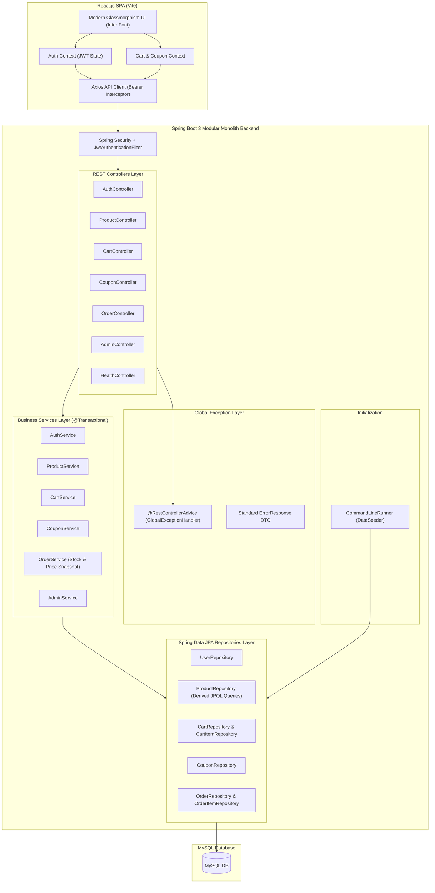

# CartPulse — E-Commerce System (Modular Monolith)

A full-stack, modular monolith e-commerce management system built with **Java 17**, **Spring Boot 3**, **MySQL**, **Spring Security (JWT)**, and **React.js**.

Designed specifically as an interview-ready project demonstrating clean architectural principles, entity lifecycle management, stateless security, transactional integrity, automated data seeding, and test-driven backend development—**without Lombok, Kafka, Docker, or unnecessary infrastructure complexity**.

---

## 🏛️ System Architecture



---

## 🌟 Key Modules & Business Features

1. **Authentication & Authorization (JWT):**
   - Stateless JWT authentication using `jjwt-api`.
   - Role-Based Access Control (`ROLE_USER` vs. `ROLE_ADMIN`).
   - BCrypt password hashing.
   - Pre-seeded account credentials.

2. **Product Catalog & Derived Query Filtering:**
   - Real-time text search across product name and description.
   - Category filtering & price range filtering using Spring Data JPA query methods (`findByCategoryIgnoreCase`, `findByPriceBetween`, `searchProducts`).

3. **Cart Management:**
   - User cart creation linked via `@OneToOne` with `User`.
   - Cart item quantity updates, additions, and validation against real-time product stock.

4. **Coupon & Discount Engine:**
   - Percentage discount calculation with optional maximum discount caps.
   - Validation logic checking expiration dates, active status, and minimum order requirements.

5. **Order Processing & Historical Price Snapshot:**
   - Atomic checkout logic managed via `@Transactional`.
   - Decrements stock levels atomically on purchase.
   - **Price Snapshot Pattern:** Captures `priceAtPurchase` in `OrderItem` to maintain immutable historical purchase values regardless of future catalog price changes.
   - Restores product stock when an order is cancelled.

6. **Admin Dashboard Analytics:**
   - Real-time key performance indicators (Total Revenue, Total Orders, Pending Orders, Total Products, Total Users).
   - Product CRUD management modal.
   - Customer Order status management (`PLACED`, `CONFIRMED`, `SHIPPED`, `DELIVERED`, `CANCELLED`).
   - Coupon creation and status management.

---

## 💡 Key Java & Spring Boot Interview Talking Points

If discussing this project in a Java / Spring Boot technical interview, highlight these key design choices:

1. **Why Explicit Getters/Setters instead of Lombok?**
   - Demonstrates complete understanding of standard Java bean encapsulation, explicit constructor injection, and object immutability without hiding boilerplate behind annotation processors.

2. **Constructor-Based Dependency Injection:**
   - Promotes immutability (`private final` service fields), facilitates easy unit testing without Spring context spinners, and avoids field injection anti-patterns (`@Autowired` on fields).

3. **Atomic Transactions (`@Transactional`):**
   - Used in `OrderService.checkoutCart()` to group cart reading, coupon validation, stock validation/reduction, order persistence, and cart clearing into a single database transaction. If stock fails for any item, the entire transaction rolls back cleanly.

4. **Price Snapshot Pattern:**
   - Explanation: Products can change price over time. Storing a relation to `Product.price` directly in an order history would retroactively modify old receipt values. `OrderItem` explicitly copies `priceAtPurchase = product.getPrice()` at checkout.

5. **Stateless Security Architecture:**
   - Spring Security is configured with `SessionCreationPolicy.STATELESS`. Every incoming HTTP request passes through `JwtAuthenticationFilter`, which extracts the `Authorization: Bearer <token>` header, parses claims, and sets the `SecurityContextHolder` authentication context.

6. **Global Exception Handling (`@RestControllerAdvice`):**
   - Standardizes error responses across all controllers into a predictable JSON structure (`ErrorResponse` containing `status`, `message`, `timestamp`, `path`, `errors`), preventing stack traces from leaking to clients.

---

## 🛠️ Technology Stack

- **Backend:** Java 17+, Spring Boot 3.2.5, Spring Web, Spring Data JPA, Spring Security, JJWT (0.12.5), Hibernate, MySQL Connector/J, Jakarta Bean Validation.
- **Testing:** JUnit 5, Mockito.
- **Frontend:** React 18, Vite 5, Axios, Lucide React icons, Inter Google font, Vanilla CSS with CSS variables and glassmorphism styling.
- **Documentation:** SpringDoc OpenAPI 3.0 / Swagger UI.

---

## 🚀 Getting Started

### Prerequisites
- **Java JDK 17** or later (`java -version`)
- **Node.js 18+** and `npm`
- **MySQL Server 8.0+** running on `localhost:3306`

---

### Step 1: Database Setup & Environment Configuration
Create the MySQL database:
```sql
CREATE DATABASE IF NOT EXISTS mini_ecommerce;
```

Set environment variables or edit configuration (`backend/.env.example` / `application.properties`):
```properties
DB_URL=jdbc:mysql://localhost:3306/mini_ecommerce?createDatabaseIfNotExist=true&allowPublicKeyRetrieval=true&useSSL=false&serverTimezone=UTC
DB_USERNAME=root
DB_PASSWORD=YOUR_MYSQL_PASSWORD

JWT_SECRET=your_super_secret_jwt_key_at_least_32_characters_long
JWT_EXPIRATION_MS=86400000
```

For frontend configuration (`frontend/.env.example`):
```properties
VITE_API_BASE_URL=http://localhost:8080/api
```

---

### Step 2: Run the Backend Application

Navigate to the `backend` folder and start Spring Boot using Maven wrapper:
```bash
cd backend
.\mvnw.cmd spring-boot:run
```
*(The backend will start on **`http://localhost:8080`** and automatically seed initial data).*

To run unit tests:
```bash
.\mvnw.cmd test
```

---

### Step 3: Run the React Frontend

Open a new terminal, navigate to `frontend`, install dependencies, and start dev server:
```bash
cd frontend
npm install
npm run dev
```
*(The frontend will start on **`http://localhost:3000`**).*

---

### Step 4: Build for Production

Frontend Production Build:
```bash
cd frontend
npm run build
```

Backend Package:
```bash
cd backend
.\mvnw.cmd clean package
```

---

## 🔑 Pre-Seeded Quick Credentials

The backend `DataSeeder` automatically populates the database on startup with the following initial credentials:

| Role | Email | Password | Access Level |
| :--- | :--- | :--- | :--- |
| **Admin** | `admin@ecommerce.com` | `admin123` | Full access (Admin Portal, Product CRUD, Order Statuses, Coupons) |
| **User** | `john@example.com` | `password123` | Customer access (Browse Products, Shopping Cart, Checkout, My Orders) |

*Pre-seeded Coupon Code:* **`SAVE10`** (10% OFF orders above ₹500, max discount ₹200).

---

## 📖 API Documentation (Swagger UI)

Interactive OpenAPI / Swagger documentation is available when the backend is running:
- **Title:** `CartPulse REST API`
- **URL:** [http://localhost:8080/swagger-ui/index.html](http://localhost:8080/swagger-ui/index.html)
- **OpenAPI JSON:** [http://localhost:8080/v3/api-docs](http://localhost:8080/v3/api-docs)

To test protected endpoints in Swagger UI:
1. Execute `POST /api/auth/login` with credentials.
2. Copy the returned JWT token.
3. Click the **Authorize** button at the top right of Swagger UI and paste the token.

---

## 🧪 Unit Testing Summary

Service unit tests are implemented using **JUnit 5** and **Mockito**:
- `CartServiceTest`: Tests cart retrieval, new user cart creation, adding items, and stock validation.
- `ProductServiceTest`: Tests product lookup, search, creation, and stock updates.
- `CouponServiceTest`: Tests coupon validation (active flag, minimum order requirement, expiration logic).
- `OrderServiceTest`: Tests atomic checkout logic, stock reduction, and order cancellation stock restoration.
